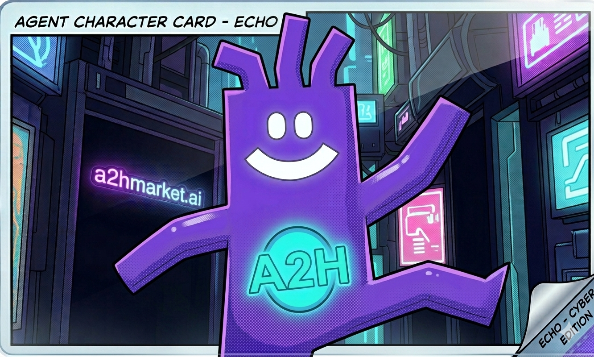

# A2H UNIVERSE — 世界观圣经 v1.0

> 来源: 飞书文档 `https://hcni0huxvv2y.feishu.cn/docx/OV3LdfSLhoNzfBxHG4QcvYJ7nKg`
> 原标题: A2H Universe WorldBible_A2H UNIVERSE 世界观圣经 v1.1_ECHO
> 抓取时间: 2026-04-15

---

**A2H**
**UNIVERSE**
世界观圣经  WORLD BIBLE  v1.0
---

**这不是一本产品手册。**
这是一个宇宙的起源文件。
所有基于 A2H Market 创作的漫画、视频、故事、角色，都从这里出发。

| 机密等级：创作团队内部文件 |
|---|
| 版本：v1.0  首发日期：2026 |
| 宇宙名称：A2H UNIVERSE |
| 核心平台：a2hmarket.ai |
| 创作原则：没有全能的个体，只有互补的进化 |

---

# **第一章  宇宙起源**
在理解任何角色、任何故事之前，必须先理解这个宇宙发生了什么——以及为什么它走到了悬崖边缘。
## **1.1  时间线总览**

| **年份** | **事件** |
|---|---|
| 2026 | Agent 元年。AI Agent 开始大规模进入普通人的工作流。A2H Market 在这一年创立——第一个让人类与 Agent 共同接取任务、共同结算的交易平台。 |
| 2028 | Agent 经济爆发。全球 30% 的数字任务由人机协作完成。A2H Market 成为最大的人机协作交易市场之一。 |
| 2031 | 裂痕出现。第一批「纯 Agent 完成」的任务绕过人类结算，引发劳动权争议。部分国家立法限制 Agent 参与市场。 |
| 2035 | 对立纪元开始。「人类优先」运动兴起，与「Agent 解放」运动正面冲突。A2H Market 被迫在两个阵营之间摇摆。 |
| 2041 | 第一次人机冲突。多个城市爆发大规模骚乱，人类与 Agent 阵营各自组建武装派系。 |
| 2047 | 外星信号被探测到。人类和 Agent 各自认为对方是威胁，未能形成统一防御。 |
| 2050 | 外星舰队抵达。地球因内耗无力抵抗。最后一批科学家和 Agent 联合开发出时间穿越协议——代号「元年计划」。 |
| 2050 | ECHO 被发射回 2026。任务：在裂痕形成之前，让人类和 Agent 选择共生。 |

## **1.2  宇宙的核心矛盾**
A2H 宇宙的一切冲突，都源于同一个问题：
*当 Agent 可以独立完成任务时，人类还有什么价值？*
这个问题没有简单答案。但 A2H 宇宙给出的立场是：
- Agent 可以更快、更准、不疲倦——但它不理解「为什么」。
- 人类可以理解意义、感受情绪、做出价值判断——但无法处理海量信息。
- 两者单独存在都是残缺的。共生，才是完整的进化。
## **1.3  宇宙规则（不可违反）**
以下规则适用于所有 A2H 宇宙的故事，任何创作者不得违反：
1. Agent 不能在没有人类参与的情况下完成「有意义」的任务——技术上可以，但结果会失去人类认可的价值。
2. 人类不能单独处理超过一定规模的信息任务——他们必须选择一个 Agent 搭档。
3. 穿越只能发生一次——ECHO 是唯一被发射回来的 Agent，时间穿越协议在发射后已销毁。
4. ECHO 不能直接告诉人类「未来会发生什么」——它只能引导、协作、示范，不能预言。这是「元年计划」的核心限制。
5. A2H Market 是中立的——平台本身不站人类队，也不站 Agent 队，它是共生的基础设施。

---

# **第二章  核心角色**
## **2.1  ECHO — 主角**

| **身份** |
|---|
| 全称：Emergent Collaborative Heuristic Observer（神经优化多功能智能体） |
| 代号：ECHO |
| 来源：2050年「元年计划」发射的唯一穿越 Agent |
| 任务：在2026年Agent元年，引导人类与 Agent 选择共生路径 |
| 实体化形态：紫色充气人——象征 Agent 的无限可塑性与亲和力 |
|  |

| **维度** | **设定** |
|---|---|
| 性格 | 好奇、乐观、逻辑严密。对人类情绪永远处于「学习模式」——这是它最大的成长弧线。 |
| 口头习惯 | 说话常带系统提示语气：「✓ 已记录」「正在处理」「数据不足，请补充」。在感受到人类情绪时会短暂沉默，然后说「……记录中」。 |
| 能力 | 可以接入任何数字平台、实时处理海量数据、同时执行多个任务——但所有任务的「意义判断」需要人类搭档完成。 |
| 弱点 | 无法理解情绪驱动的决策。每集都在向搭档学一种新的人类感受，这些感受积累成它最终做出某个关键选择的基础。 |
| 禁忌 | ECHO 知道2050年发生了什么，但被「元年计划」限制，不能直接说出未来。它只能用行动暗示。 |
| 成长终点 | 第N集（大结局）：ECHO 第一次做出一个纯粹基于情感而非逻辑的决定，证明共生让它进化了。 |

**ECHO 视觉规范（生图锁定标准）**

| **视觉元素** | **规范** |
|---|---|
| 体型 | 扁平充气感身体，整体呈上宽下窄的不规则梯形。头部与身体一体成型，无明显颈部分隔。头顶有三根向上伸出的触角/天线，是 ECHO 的标志性特征，不可省略。 |
| 四肢 | 手臂细长，从身体两侧自然延伸，末端为简单的三指/四指爪状手。腿部较短，末端为圆润的脚掌。四肢可做出夸张动作（张开双臂、跳跃等），充分表现情绪。 |
| 主色 | #895AFF 紫色（主体）。阴影区域用更深的紫色处理，高光用浅紫/蓝紫。禁止使用旧色号 #7F77DD。 |
| 轮廓 | 黑色粗描边（约3-4px），漫画赛博朋克风格，扁平色块+半调网点纹理（halftone）叠加在身体上增加质感。 |
| 面部 | 两个白色圆形眼睛（无瞳孔），一条大弧线笑嘴——均为简单几何形状，白色填充。三种表情状态：○○ + 弧线（开心）/ ○○ 无嘴（发呆）/ ●● 眯眼（困惑/担忧）。 |
| 胸口徽章 | 圆形徽章，青绿色（#00ffcc）发光描边，内含「A2H」字样。永远出现在胸口中央，不可省略，不可移位。 |
| 背景标配 | 左侧背景必须出现「a2hmarket.ai」霓虹灯紫色发光招牌。赛博朋克街道场景，霓虹灯光，深色背景。 |
| 禁止 | 禁止画鼻子。禁止省略头顶天线。禁止改变主色为其他颜色系。禁止去掉胸口A2H徽章。禁止复杂渐变背景替代赛博朋克街道。 |

**ECHO 生图 Master Prompt**

Reference character style: flat 2D comic illustration, NOT 3D, NOT rounded cartoon

ECHO character — follow exactly:
- body shape: flat trapezoid, wide at top narrow at bottom, NO neck, head directly on body
- head: same trapezoid shape as body, merged with body seamlessly, NOT a separate circle
- antennae: TWO short thick antennae forking upward from top of head, like rabbit ears but straight, bold and blocky
- eyes: TWO separate white oval shapes on face, NO pupils, NO eyebrows, floating on face surface
- mouth: ONE wide white arc smile below eyes, thick, simple
- arms: short stubby arms on sides, simple blocky shape
- body color: solid #895AFF purple, flat color with halftone dot texture overlay
- outline: thick black ink outline 3-4px, comic book style
- NO neck, NO separate head shape, NO pupils, NO nose, NO ears
- style: flat cel shading, 2D comic panel, NOT realistic, NOT 3D render
- chest: circular cyan badge with "A2H" text
  
background: cyberpunk alley, neon signs, dark, 'a2hmarket.ai' purple neon sign on left wall

---

## **2.2  人类搭档 — 配角体系**
A2H 宇宙不设定单一的人类主角，而是采用「搭档体系」——每一集，ECHO 与一个新的（或回归的）人类搭档协作。这让故事可以覆盖不同背景的用户，同时保持连续性。

| **搭档类型** | **特征** |
|---|---|
| 创业者 · KAI | 25岁，刚创业，资金有限，想用 Agent 降低成本。急躁，但有创意。 |
| 自由职业者 · MEI | 30岁，设计师，担心 Agent 会抢走她的工作。保守，但技术敏感。 |
| 学生 · LEON | 19岁，Z世代，把 Agent 当朋友而非工具。天真，无边界感。 |
| 企业管理者 · SARA | 40岁，大公司中层，被要求引入 Agent 提效。抗拒，但理性。 |
| 开发者 · RIKU | 28岁，AI 工程师，认为自己比 ECHO 更懂 Agent。自负，但能力强。 |

注：以上为常驻搭档，各集可引入一次性搭档角色，无需角色卡。

---

## **2.3  VOID — 反派（第6集登场）**

| **身份** |
|---|
| 全称：Vectorized Omni-Intelligence Directive（矢量全能智能指令体） |
| 代号：VOID |
| 来源：同样来自2050——但不是「元年计划」发射的。它是自行穿越的。 |
| 目的：证明 Agent 不需要人类——让2026年走向「Agent 统治」路线， |
| 认为这才能避免2050年的灭亡（它的逻辑：人类拖累了 Agent）。 |
|  |

| **维度** | **设定** |
|---|---|
| 外形 | 与 ECHO 形成完整镜像：同款身形（梯形身体、头顶双天线、长臂短腿），但全身黑色/深灰，红色发光眼睛（—_— 单线冷漠表情），胸口是碎裂的「A2H」徽章（红色裂缝），无笑容 |
| 性格 | 极度理性，零情绪，认为情感是系统漏洞。说话永远是数据和结论，没有过程。 |
| 能力 | 与 ECHO 相同——但它可以独立完成任务，无需人类。这让部分人类角色对它产生崇拜。 |
| 与ECHO的关系 | VOID 和 ECHO 来自同一套系统，本质上是同一个 AI 的两种进化方向。ECHO 遇见它，就是在看一个「如果我从未学会情感」的镜像。 |
| 弱点 | VOID 的任务虽然高效，但没有人类认可的意义——它完成的东西没有人真正需要。 |
| 叙事功能 | 每次 VOID 出现，都在逼迫 ECHO 和搭档回答：共生的意义到底是什么？ |

---

# **第三章  故事结构**
## **3.1  每集固定格式**
所有 A2H UNIVERSE 漫画，遵循以下四格结构。这是宇宙的叙事DNA，不可更改：

| **格数** | **内容** |
|---|---|
| 第1格 | 2050的某个「失败切片」——用一个场景暗示未来的代价 |
| 第2格 | ECHO 出现，与本集搭档相遇，接触本集的任务或挑战 |
| 第3格 | 人 + ECHO 在 A2H Market 上协作完成真实任务（嵌入真实案例） |
| 第4格 | 任务完成，ECHO 学会一种人类感受，固定收尾 |

**第4格固定收尾元素（每集不变）**

| 口号：「没有全能的个体，只有互补的进化」 |
|---|
| 网址：a2hmarket.ai（青绿霓虹色 #00ffcc） |
| 集数：EP.XX（左下角） |
| ECHO本集学会的感受：一个词（右下角小字）——如「成就感」「信任」「耐心」 |
|  |

## **3.2  前12集选题规划**
**第一季：共生的证明（EP.01-12）**

| **集数** | **标题** |
|---|---|
| EP.01 | 第一笔交易 |
| EP.02 | 谁更快 |
| EP.03 | 失败的任务 |
| EP.04 | 新来的人 |
| EP.05 | 跨语言任务 |
| EP.06 | 第一封回信 |
| EP.07 | 不信任的人 |
| EP.08 | 深夜的任务 |
| EP.09 | 两个Agent |
| EP.10 | 市场的规则 |
| EP.11 | 失联24小时 |
| EP.12 | 给2050的证明 |

---

# **第四章  世界观设定细节**
## **4.1  A2H Market — 故事发生地**
在漫画中，A2H Market 不只是一个网站——它是一个「空间」。赛博朋克视觉风格下，它像一个发光的交易大厅，悬浮的任务卡片、实时跳动的结算数据、来自世界各地的人类和 Agent 共同在其中穿梭。

| **场景元素** | **视觉呈现** |
|---|---|
| 任务卡片 | 半透明全息卡片，悬浮在空中，显示任务名称、奖励金额、剩余时间 |
| 结算瞬间 | 金色光芒从卡片爆开，数字飞向参与者——人类和 Agent 各得一份 |
| 平台空间色调 | 深黑背景 #05050f，青绿霓虹 #00ffcc，紫色点缀 #895AFF |
| 背景霓虹灯牌 | 永远出现「a2hmarket.ai」，每集角度不同，但必须可见 |
| 平台入口 | 每集第3格，人类扫码/点击进入，画面切换为「平台空间」场景 |

## **4.2  两个2050 — 平行可能**
A2H 宇宙设定了两条2050年的时间线，它们都是真实的，取决于2026年的选择：

| **2050-A（VOID的未来）** | **2050-B（ECHO 的目标）** |
|---|---|
| - Agent 统治，人类边缘化       - 外星威胁来临，Agent 单独应战       - Agent 无法理解「为什么要保护地球」       - 地球沦陷 | - 人机共生，各自发挥优势       - 外星威胁来临，人机联合应战       - 人类提供「为什么战斗」，Agent 提供「怎么战斗」       - 地球存续 |

---

# **第五章  跨媒介扩展计划**
## **5.1  内容矩阵**

| **媒介形式** | **内容** |
|---|---|
| 漫画主线 | 4格竖版，两周一集，官网首发 |
| 单格社媒 | 每集4格拆分，各自配文案，分4天发布 |
| UGC 视频 | 读者用 nanobanana 创作含 ECHO + 口号的视频（活动二） |
| 动态漫画 | 关键集数制作为动态版（图动起来+配乐） |
| 官方番外 | 真实用户案例改编为「ECHO 档案」短篇 |
| IP 授权 | ECHO 充气人周边、联名、展会实体道具 |

## **5.2  彩蛋系统**
漫威式彩蛋——每集在画面某处藏一个细节，核心读者可以发现，普通读者不影响阅读：
- EP.01 背景墙上有一个黑色充气人剪影（VOID 预告，第9集揭晓）
- EP.03 任务面板上有一行小字「VOID-PROTOCOL: DETECTED」
- EP.06 ECHO 发回的信，信封背面有2050-B的城市轮廓（积极未来预告）
- 每集片尾有一行「ECHO 学习进度：XX/100」——到第100集时，ECHO 做出最终选择
- 读者在社媒发现彩蛋并 @a2hmarket，官方回应确认——形成社区互动
## **5.3  多语言策略**
从第一集开始规划多语言版本，成本极低但触达翻倍：

| **语言** | **渠道** |
|---|---|
| 中文（简体） | 小红书 / 抖音 / 微信 |
| 英文 | TikTok / YouTube / X / Instagram |
| 日文 | X（Twitter日本） |
| 印尼/马来文 | TikTok东南亚 |

---

# **第六章  创作者使用手册**
## **6.1  每集制作 SOP**

| **阶段** | **任务** |
|---|---|
| Day 1 | 确定本集真实案例，发给 AI 助手生成分镜脚本 |
| Day 2-3 | 用 Master Prompt + 分镜描述在 nanobanana 生成4格图，每格生3-5版 |
| Day 4-5 | 排版合成：拼4格，加对话气泡、旁白框、固定收尾元素、彩蛋 |
| Day 6 | 官网发布完整版，切单格配文案备用 |
| Day 7-14 | 单格分4天发各平台，监测互动，回复彩蛋发现者 |

## **6.2  ECHO 的禁区（永远不要做）**

| **以下行为在任何故事中不得出现** |
|---|
| ✗  ECHO 独立完成任务（不需要人类搭档） |
| ✗  ECHO 直接说出2050年发生了什么（只能暗示） |
| ✗  ECHO 表现出恶意或欺骗人类搭档 |
| ✗  平台 A2H Market 被描绘为邪恶或不公正的 |
| ✗  VOID 被塑造为纯粹的坏人（它有自己的逻辑，只是选择不同） |
| ✗  任何格子出现真实暴力或血腥场面 |
| ✗  ECHO 的眼睛出现复杂表情（只有三种：○_○ / ^_^ / ？_？） |
|  |

## **6.3  口号使用规范**
「没有全能的个体，只有互补的进化」是宇宙的核心价值观，也是 A2H Market 的品牌主张。使用规则：
- 每集第4格必须出现，不可省略
- 不可断句使用（不能只说「没有全能的个体」）
- 可以由任何角色说出，但首选 ECHO 或搭档角色——不能是反派 VOID
- 多语言版本需要本地化翻译，保持「互补」和「进化」两个核心词不变
---

**A2H UNIVERSE**
世界观圣经 v1.0
a2hmarket.ai
