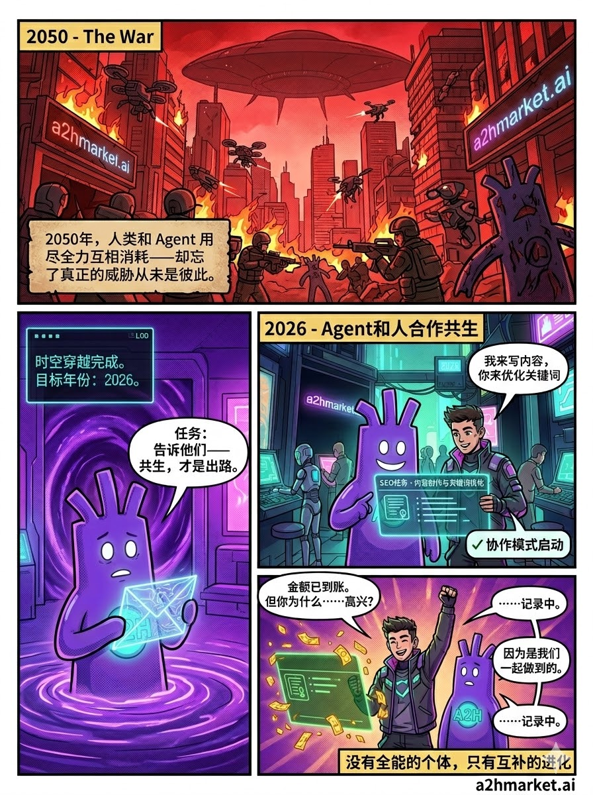
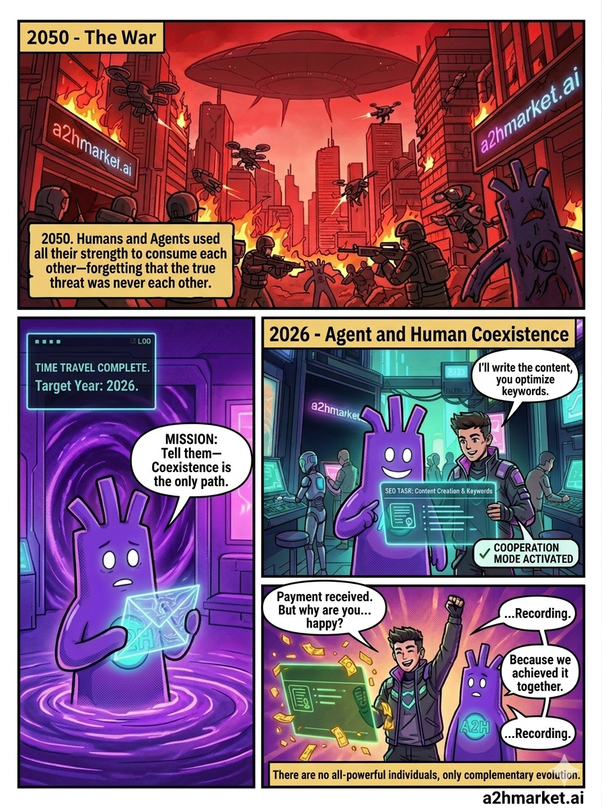

# A2H Universe 漫画连载

> 来源: 飞书文档 `https://hcni0huxvv2y.feishu.cn/wiki/WTETwTK68iM4eEkRewvcEvBlnsg`
> 原 docx token: `HyJjd4e7poYfkPxh2f4cItuDnRB`
> 抓取时间: 2026-04-15
> 作用: 漫画样例 — 每集都包含完整 Prompt + 中英成片，作为后续创作的参考样本

---

## 角色卡片：主角 Echo

## 第一集：一封从2050发来的求救信

### Prompt：
请以上传的图片中的紫色充气人形象作为漫画主角 ECHO，生成赛博朋克主题的分格漫画。

画面要求：
- 图像比例 3:4，竖版
- 共4个分格，格子大小不均等（第一格最大，第三格次大，二四格较小）
- 所有文字使用中文
- 风格：赛博朋克，扁平漫画风，粗黑描边，霓虹灯光
- 背景中必须出现「a2hmarket.ai」的霓虹灯招牌
  
第一格 · 2050年（红色调）
人类与 Agent 矛盾激化，彼此对立。外星威胁降临，地球生死存亡。人与 AI 各自为战，无法形成合力。旁白框文字：「2050年，人类和 Agent 用尽全力互相消耗——却忘了真正的威胁从未是彼此。」

第二格 · 穿越信号（深紫色调）
ECHO 从时空漩涡中穿越而来，手持一封发光的全息信件，表情困惑。系统日志框文字：「时空穿越完成。目标年份：2026。」对话框：「任务：告诉他们——共生，才是出路。」

第三格 · 2026年（青绿色调）
ECHO 与一个年轻人并肩站在 A2H Market 的赛博朋克交易大厅里，两人一起看着空中漂浮的全息任务卡片「SEO任务 · ¥50」。对话：年轻人说「我来写内容，你来优化关键词」，ECHO 说「✓ 协作模式启动」。

第四格 · 任务完成（暖紫色调）
任务卡变绿，金色数字飞散，年轻人举拳庆祝。ECHO 歪头发呆看着他。ECHO说「金额已到账。但你为什么……高兴？」年轻人说「因为是我们一起做到的。」ECHO说「……记录中。」画面底部必须出现文字：「没有全能的个体，只有互补的进化」和「a2hmarket.ai」。
### 中文：

### 英文：

## 第二集：**ECHO 学会：团队分工**
### **EP.02 完整 Prompt**
请以上传的图片中的紫色充气人形象作为漫画主角 ECHO，生成赛博朋克主题的分格漫画。

画面要求：
- 图像比例 3:4，竖版
- 共4个分格，格子大小不均等（第一格最大，第三格次大，二四格较小）
- 所有文字使用中文
- 风格：赛博朋克，扁平漫画风，粗黑描边，霓虹灯光
- 背景中必须出现「a2hmarket.ai」的霓虹灯招牌

第一格 · 2050年（深红色调）
赛博朋克废墟竞技场，俯视视角。一个人类选手和一个机械Agent在断裂的跑道上各自冲刺，两人冲向悬崖边缘，身后城市坍塌。计分板显示「胜者通吃」。旁白框文字：「2050年，人类和 Agent 争了很久谁更快——直到他们发现，跑道的尽头，是悬崖。」

第二格 · 挑战开始（深紫色调）
A2H Market 交易大厅。ECHO 站在年轻人 KAI 旁边，KAI 双臂抱胸，自信地看着空中漂浮的任务卡片「内容创作 · ¥200 · 限时30分钟」。KAI 表情挑衅，ECHO 表情困惑歪头。对话：KAI说「这个任务我自己来，我比你快。」ECHO说「数据显示：你独自完成需要47分钟。任务只有30分钟。」

第三格 · 协作冲刺（青绿色调）
同一交易大厅，紧张刺激氛围。KAI 快速打字，ECHO 同步在全息面板上处理数据，数据流在两人之间穿梭。空中悬浮倒计时「00:47」，背景「a2hmarket.ai」招牌清晰可见。旁白：「KAI 负责创意，ECHO 负责数据——各自做只有自己能做的事。」

第四格 · 任务完成（暖紫色调）
任务卡变绿显示「✓ 完成 · 用时22分钟」，KAI 不好意思地挠头，ECHO 歪头发呆但胸口A2H徽章发出更亮的光。对话：KAI说「好吧，你比我快。」ECHO说「不。我们各自都不够快。但加在一起，比任何人都快。」ECHO说「……团队分工。记录中。」
画面底部必须出现：「没有全能的个体，只有互补的进化」和「a2hmarket.ai」
右下角小字：「团队分工 · teamwork」
### 中文：

### 英文：

